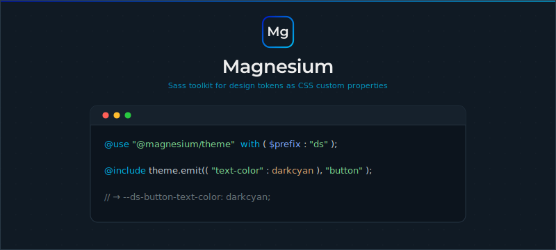

<div align="center">



</div>

[](https://www.npmjs.com/package/@magnesium/theme)
[](https://www.npmjs.com/package/@magnesium/theme)
[](https://www.npmjs.com/package/@magnesium/theme)

## Introduction

The Magnesium Sass Framework helps you easily develop your Web Design System.

## Installing

```shell
npm install @magnesium/theme
```

## Playground

Try it live on StackBlitz:

[](https://stackblitz.com/~/github.com/magnesiumlabs/magnesium)

Or run it locally:

```shell
npm run dev
```

## Usage

```scss
@use "@magnesium/theme" with ($prefix: "ds");
```

### Options

| Option    | Description                                             |
|-----------|---------------------------------------------------------|
| `$prefix` | Global prefix for all custom properties. Default: `mg`. |

## Mixins

### `theme($refs, $tokens, $namespace, $include, $exclude)`

Validates tokens then emits CSS custom properties in one call.

```scss
@use "@magnesium/theme" with ($prefix: "ds");

$refs: ("text-color": darkcyan, "text-size": 16px);

.foo {
    @include theme.theme($refs, ("text-color": darkorange), "button");
}
```

```css
.foo {
    --ds-button-text-color: darkorange;
}
```

`$include` and `$exclude` work the same as in `emit()`.

### `emit($tokens, $namespace, $include, $exclude, $layer)`

Emits CSS custom properties declarations.

```scss
@use "@magnesium/theme" with ($prefix: "ds");

.foo {
    @include theme.emit(("text-color": darkcyan), "button");
}
```

```css
.foo {
    --ds-button-text-color: darkcyan;
}
```

Use `$layer` to wrap the output in a named [cascade layer](https://developer.mozilla.org/en-US/docs/Web/CSS/@layer):

```scss
:root {
    @include theme.emit(("text-color": darkcyan), "button", $layer: "tokens");
}
```

```css
@layer tokens {
    :root {
        --ds-button-text-color: darkcyan;
    }
}
```

### `scheme($scheme, $selector)`

Emits scoped declarations for a color scheme.

Use `$scheme` alone to emit a `@media (prefers-color-scheme)` block:

```scss
@include theme.scheme("dark") {
    :root {
        @include theme.emit(("primary": darkorange), "color");
    }
}
```

```css
@media (prefers-color-scheme: dark) {
    :root {
        --ds-color-primary: darkorange;
    }
}
```

Use `$selector` to scope to a class or attribute instead:

```scss
@include theme.scheme("dark", $selector: "[data-theme='dark']") {
    @include theme.emit(("primary": darkorange), "color");
}
```

```css
[data-theme='dark'] {
    --ds-color-primary: darkorange;
}
```

## Functions

### `variable($tokens, $token, $namespace, $fallback)`

Returns a CSS `var()` reference for a single token.

```scss
@use "@magnesium/theme" with ($prefix: "ds");

$tokens: ("text-color": darkcyan);

.foo {
    color: theme.variable($tokens, "text-color", "button");
}
```

```css
.foo {
    color: var(--ds-button-text-color);
}
```

### `refs($tokens, $namespace)`

Transforms a tokens map into `var()` CSS custom property references.

```scss
@use "@magnesium/theme" with ($prefix: "ds");

$tokens: theme.refs(("text-color": darkcyan, "text-size": 16px), "button");
// -> ("text-color": var(--ds-button-text-color, darkcyan), "text-size": var(--ds-button-text-size, 16px))
```

### `validation($refs, $tokens)`

Validates user-provided tokens against a reference schema. Throws `@error` if a token is unsupported.

```scss
@use "@magnesium/theme";

$refs: ("text-color": darkcyan);
$tokens: ("text-color": darkorange);

$tokens: theme.validation($refs, $tokens);
```

### `name($name...)`

Creates a hyphenated name prefixed with the configured `$prefix`.

```scss
@use "@magnesium/theme" with ($prefix: "ds");

theme.name("button", "text-color"); // -> "ds-button-text-color"
```

## Migration from v4

Import the compatibility layer to keep using the v4 API:

```scss
@use "@magnesium/theme/compat" as theme;
```

| v4                                             | v5                                             |
|------------------------------------------------|------------------------------------------------|
| `config($prefix: "ds")`                        | `@use "@magnesium/theme" with ($prefix: "ds")` |
| `create-name("btn", "color")`                  | `name("btn", "color")`                         |
| `create-theme-vars($tokens, "btn")`            | `refs($tokens, "btn")`                         |
| `emit-variable($tokens, "token", true, "btn")` | `variable($tokens, "token", "btn", true)`      |
| `emit-custom-props($tokens, "btn")`            | `emit($tokens, "btn")`                         |
| `emit-color-scheme("dark")`                    | `scheme("dark")`                               |
