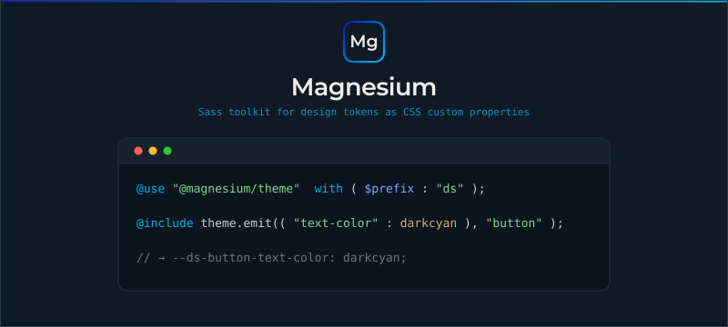

# Magnesium

[](https://www.npmjs.com/package/@magnesium/theme)
[](https://www.npmjs.com/package/@magnesium/theme)
[](https://www.npmjs.com/package/@magnesium/theme)

## Introduction

Sass toolkit for managing design tokens as CSS custom properties. The model is **define → emit → consume**: declare
tokens as plain Sass maps, emit them as scoped, prefixed custom properties, then reference them in your rules.

This README is a quick overview, the full guides and API reference live at **[magnesium.dev](https://magnesium.dev)**.

<div align="center">



</div>

## Requirements

| Dependency | Version                    |
|------------|----------------------------|
| Node.js    | `^20.19.0 \|\| >= 22.12.0` |
| Sass       | `>= 1.97.1`                |

## Installing

```shell
npm install @magnesium/theme
```

## Playground

Try it live on StackBlitz:

[](https://stackblitz.com/~/github.com/magnesiumlabs/magnesium)

Or run it locally:

```shell
npm run dev
```

## Usage

Configure the prefix once, at your compilation entry point, then define, emit and consume tokens:

```scss
@use "@magnesium/theme" with ($prefix: "ds");

// 1. Define — plain Sass maps, no output.
$tokens: ("text-color": darkcyan);

// 2. Emit — declare them as custom properties.
:root {
    @include theme.emit($tokens, "button"); // --ds-button-text-color: darkcyan;
}

// 3. Consume — reference them in your rules.
.button {
    color: theme.variable($tokens, "text-color", "button"); // var(--ds-button-text-color)
}
```

Emit and consume derive the custom property name from the same `$prefix` and `$namespace`, so the two sides cannot
drift apart.

### Options

| Option    | Description                                                                        |
|-----------|------------------------------------------------------------------------------------|
| `$prefix` | Global prefix for all custom properties. Set to `false` to disable. Default: `mg`. |

> Configure `$prefix` once. Setting it in multiple files causes a Sass error. With the `pkg:` importer, use
> `@use "pkg:@magnesium/theme"`.

## API

The split follows the model: mixins emit CSS, functions return values.

### Define

Tokens are plain Sass maps — there is no API to learn. Nest them freely, nested maps are flattened on emit. One
function guards the shape:

| Function                     | Description                                                                   |
|------------------------------|-------------------------------------------------------------------------------|
| `validation($refs, $tokens)` | Validates tokens against a reference schema; throws `@error` on unknown keys. |

### Emit

| Mixin                                                           | Description                                                                                                      |
|-----------------------------------------------------------------|------------------------------------------------------------------------------------------------------------------|
| `emit($tokens, $namespace, $include, $exclude, $layer)`         | Emits CSS custom property declarations. Filter keys with `$include` / `$exclude`, wrap in `@layer` via `$layer`. |
| `theme($refs, $tokens, $namespace, $include, $exclude, $layer)` | `validation()` then `emit()` in one call. Throws `@error` on unknown tokens.                                     |
| `scheme($scheme, $selector, $layer)`                            | Scopes `@content` to a color scheme via `@media (prefers-color-scheme)`, or an explicit `$selector`.             |

### Consume

| Function                                           | Description                                                                                              |
|----------------------------------------------------|----------------------------------------------------------------------------------------------------------|
| `variable($tokens, $token, $namespace, $fallback)` | Returns a `var()` reference for a single token. Throws `@error` if the token is missing from the map.    |
| `ref($token)`                                      | Returns a `var()` reference from a token name alone, without hardcoding the prefix.                      |
| `refs($tokens, $namespace)`                        | Transforms a tokens map into `var()` references with fallbacks. Pass the result to `emit()` to alias it. |
| `name($name...)`                                   | Builds the hyphenated, prefixed name. Shared by everything above, which keeps emit and consume in sync.  |

See [magnesium.dev](https://magnesium.dev) for parameters and examples.

## Migration from v4

The v4 API is **deprecated** and will be removed in v6. Import the compatibility layer to keep it working while you
migrate — each deprecated call emits a `@warn`:

```scss
@use "@magnesium/theme/compat" as theme;
```

| v4                                                | v5                                             |
|---------------------------------------------------|------------------------------------------------|
| `config($prefix: "ds")`                           | `@use "@magnesium/theme" with ($prefix: "ds")` |
| `create-name("button", "color")`                  | `name("button", "color")`                      |
| `create-theme-vars($tokens, "button")`            | `refs($tokens, "button")`                      |
| `emit-variable($tokens, "token", true, "button")` | `variable($tokens, "token", "button", true)`   |
| `emit-custom-props($tokens, "button")`            | `emit($tokens, "button")`                      |
| `emit-theme-vars($refs)`                          | `emit($tokens, "button")`                      |
| `emit-color-scheme("dark")`                       | `scheme("dark")`                               |

> `emit-theme-vars()` re-emitted the values carried by a `create-theme-vars()` map, so it maps back to the raw tokens.
> Passing a `refs()` map to `emit()` is a different operation — it declares aliases pointing at another layer.

See the full [migration guide](https://magnesium.dev/guide/migration) for before/after examples.
